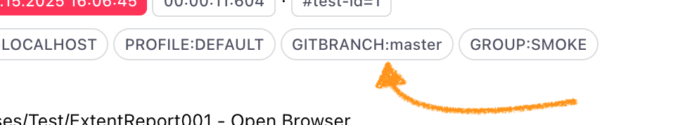
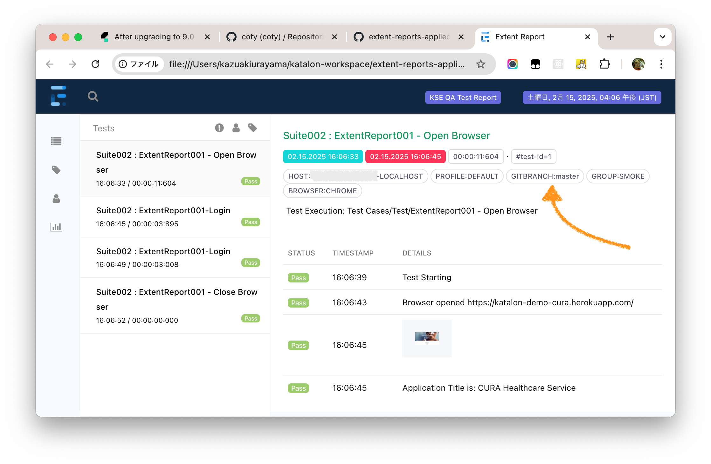

# How to apply Extent Reports to Katalon Studio project

This repository presents a [Katalon Studio](https://katalon.com/katalon-studio) project which integrates the [Extent Reports](https://extentreports.com/) to compile a test execution report in HTML. The Extent Reports enables users to customize the content of the report.

## Problem to solve

In the Katalon Community forum, there was a topic

-   <https://forum.katalon.com/t/is-possible-to-add-in-html-or-pdf-reports-the-git-current-branch/163746>

Let me quote the part of the pos here:

> I´m trying to customize the html and pdf report in order to show some usefull information.
>
> I would like to show the current branch of the repository that I´m testing in the Excecution environment section of the report

<figure>

</figure>

The original poster tried to customize the built-in HTML report compiled by Katalon Studio, but he could not find out the way. I knew the [answer](https://forum.katalon.com/t/is-possible-to-add-in-html-or-pdf-reports-the-git-current-branch/163746/3) to him. The Katalon built-in report is not customizable at all. Then, what should he do?

## Solution

In the [following post](https://forum.katalon.com/t/is-possible-to-add-in-html-or-pdf-reports-the-git-current-branch/163746/7), I suggested [Extent Reports](https://extentreports.com/). Using it, he should be able to compile a new test execution report. It would be easy to insert the Git branch name, like `GIT BRANCH: master`.

## Description

In the GitHub, I found a public repository by [coty](https://github.com/coty), Katalon CTO.

-   <https://github.com/coty/extent-report-sample>

The repository contains a Katalon Studio project. Katalon users can learn how to use the Extent Reports in a Katalon project.

I forked the project to form a new GitHub repository at

-   <https://github.com/kazurayam/extent-reports-applied-to-katalon-studio-project>

I made some changes in the forked repository, and got a success to create a HTML report that displays :

## Environment

I used

-   macOS Sonoma 14.7.3

-   Katalon Studio Free 10.1.0

## How to run the demo

You can run the project and see the demonstration as follows:

1.  Clone the Git repository <https://github.com/kazurayam/extent-reports-applied-to-katalon-studio-project> to your local machine.

2.  Open the project with your Katalon Studio. Execute "Test Suites/Suite002". It will take 30 seconds or so.

3.  When the Test Suite finished, you will find `<projectDir>/Extent/yyyyMMdd_hhmmss/kseqatestreport.html`, which looks something like this:

<figure>

</figure>

## How the project is coded

[My demo project](https://github.com/kazurayam/extent-reports-applied-to-katalon-studio-project) is entirely a fork from coty’s [original](https://github.com/coty/extent-report-sample) project.

I made several changes my demo project. You can find the exact differences between the original and my derivatives at the GitHub diff compare page at

-   <https://github.com/kazurayam/extent-reports-applied-to-katalon-studio-project/compare/original…​0.0.1>

Notably, I made 2 changes:

### A new class `com.kazurayam.ks.ExtentReportsKeyword`

I added a new class [`com.kazurayam.ks.ExtentReports`](https://github.com/kazurayam/extent-reports-applied-to-katalon-studio-project/blob/master/Keywords/com/kazurayam/ks/ExtentReportsKeyword.groovy). This class borrows all the methods of the [`com.katalon.extent.report.ExtentReport`](https://github.com/kazurayam/extent-reports-applied-to-katalon-studio-project/blob/master/Keywords/com/katalon/extent/report/ExtentReport.groovy) class as componet. However, my class is capable to inject my own customization in to the report. For example, see the `startEReport` method:

       @Keyword
        def startEReport(TestCaseContext testCaseContext) {
            component.startEReport(testCaseContext)
            // customize the report!
            component.extentTest.assignCategory("GIT BRANCH: " + getGitBranch())
        }

### Changed the TestListener

I edited the `Test Listeners/ExtentReportsListener.groovy` so that it no longer calls the original `com.katalon.extent.ExtentReport` keyword. Instead, It calls the new `com.kazurayam.ks.ExtentReportKeyword`. You can see the diff of old/new `ExtentReportsListener` at:

-   <https://github.com/kazurayam/extent-reports-applied-to-katalon-studio-project/compare/original…​0.0.1#diff-f4ea12441d88d4878f66d8412e61ca8c2de6bdb20a6d99f31f62a5fa655857c0>

I would quote a small piece out of the changes:

            @BeforeTestSuite
            def sampleBeforeTestSuite(TestSuiteContext testSuiteContext) {
    -               //CustomKeywords.'com.katalon.extent.report.ExtentReport.deleteFolderContents'()
    -               CustomKeywords.'com.katalon.extent.report.ExtentReport.attachEReport'(testSuiteContext, "Extent Report", "KSE QA Test Report")
    +               //CustomKeywords.'com.kazurayam.ks.ExtentReportsKeyword.deleteFolderContents'()
    +               CustomKeywords.'com.kazurayam.ks.ExtentReportsKeyword.attachEReport'(testSuiteContext, "Extent Report", "KSE QA Test Report")
            }

## How the external dependancies are managed?

If you look into the `<projectDir>/Dependencies`, you will find several jar files on which this project depends.

    $ tree Drivers
    Drivers
    ├── extentreports-5.1.1.jar
    ├── freemarker-2.3.32.jar
    ├── katalon_generated_extentreports-5.1.1.jar
    ├── katalon_generated_freemarker-2.3.32.jar
    ├── katalon_generated_gson-2.10.1.jar
    ├── katalon_generated_lombok-1.18.26.jar
    ├── katalon_generated_reactive-streams-1.0.4.jar
    ├── katalon_generated_rxjava-3.1.8.jar
    ├── reactive-streams-1.0.4.jar
    └── rxjava-3.1.8.jar

    1 directory, 10 files

If you are going to use Externt Reports in your own Katalon project, you want to copy those jar files into the `Drivers`

If you removed all those files, you can restore them by invoking a Gradle build:

    :~/katalon-workspace/extent-reports-applied-to-katalon-studio-project (master *)
    $ rm Drivers/*
    :~/katalon-workspace/

    $ gradle katalonCopyDependencies
    ...
    BUILD SUCCESSFUL in 1s
    1 actionable task: 1 executed
    :~/katalon-workspace/

    $ ls Drivers/
    katalon_generated_extentreports-5.1.1.jar
    katalon_generated_freemarker-2.3.32.jar
    katalon_generated_gson-2.10.1.jar
    katalon_generated_lombok-1.18.26.jar
    katalon_generated_reactive-streams-1.0.4.jar
    katalon_generated_rxjava-3.1.8.jar

If you are interested in how Gradle works in this project, you should study the [build.gradle](https://github.com/kazurayam/extent-reports-applied-to-katalon-studio-project/blob/master/build.gradle) file.

## Extent Report integration plugin

Katalon offers a plugin named [ExtentReport integration plugin](https://docs.katalon.com/katalon-studio/integrations/test-analysis/extent-reports-integration). It was first published in April 2024 on GitHub as a free stuff.

-   <https://forum.katalon.com/t/katalon-and-extent-reports-integration/44337/3>

Later in Jun 2024, the integration plugin was changed to be an enterprise plugin.

-   <https://forum.katalon.com/t/katalon-and-extent-reports-integration/44337/7>

We can read the [Changelog](https://store.katalon.com/product/387/Extent-Report-Integration/change-logs) of the integration plugin. The Changelong shows that several updates was made at 05 Feb 2025. I believe, the plugin will be maintained by Katalon as needed in future.

However I personally do not have an Enterprise license, so that I can not study the Extent Report integration plugin at all. I have no idea what changes were made in the recent updates.
